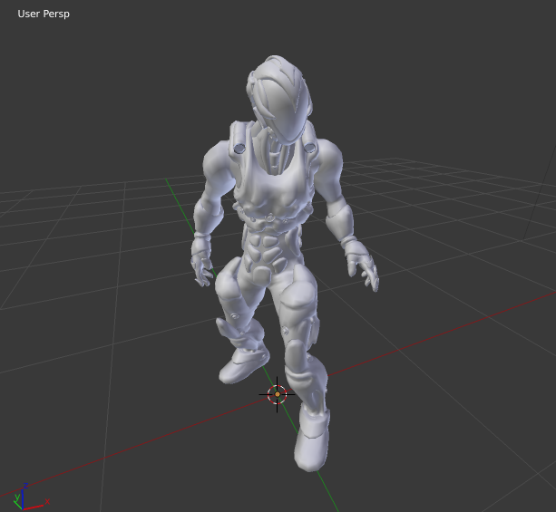
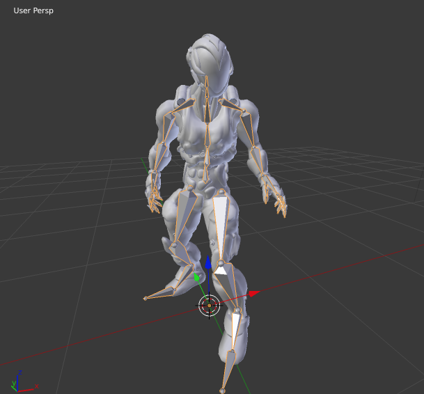
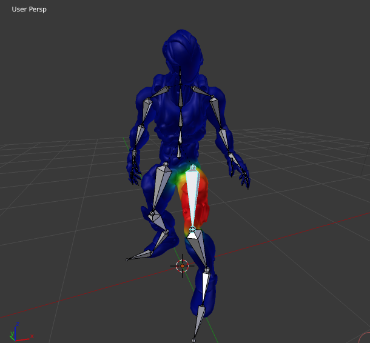
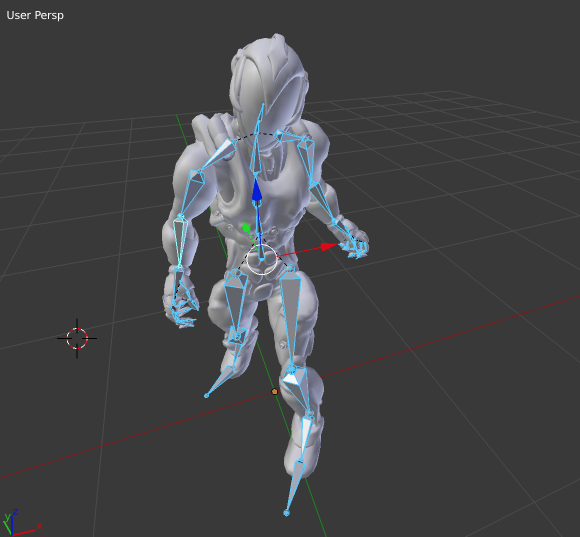
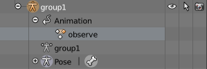
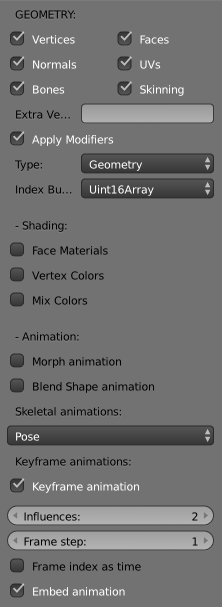

# Animation Clips

The Animation Module provides a convenient approach to animate your models.
Three.js provides an animation system, but you would need to setup the animation mixer, actions, and clips for your  models.
With the `AnimationModule`, a few lines of code is enough to get going with playing various loops your models might have.

### Pipeline

A simple pipeline with Blender to get animated models on the browser:

#### Blender
- Model your mesh

Modeling your mesh first, here is the model used in the Alien animation example.



- Add bones

Then add bones to form the armature of the model for animation.



- Weight assign (Skin/Rig)

Assign weight to vertices for the bones to influence.



- Add animation frames

Create frames to start animating, here using animation frames.
Use the dope sheet/actions editor.



- Animation names

Your model might have multiple animations (actions/clips), here is the given name for the single animation created for this model.



- Export

Finally, export to three.js json format, use the Blender exporter plugin, and ticket the appropriate options.




#### Whitestorm
- Create the animation module, passing your `app` as parameter.

```js
const animationModule = new AnimationModule(app);
```

- Import your model as a SkinnedMesh, then play your clip

```js
new Importer({
  parser(geometry, materials) {
    return new THREE.SkinnedMesh(geometry, materials);
  },

  url: `path/to/model.json`,
  useCustomMaterial: true,

  material: new THREE.MeshStandardMaterial({
    skinning: true
  }),

  modules: [animationModule]
}).addTo(app).then(() => {
  animationModule.play('clipName');
});
```

That's it. The clip will kick off after the model is loaded, playing the given clip name.
